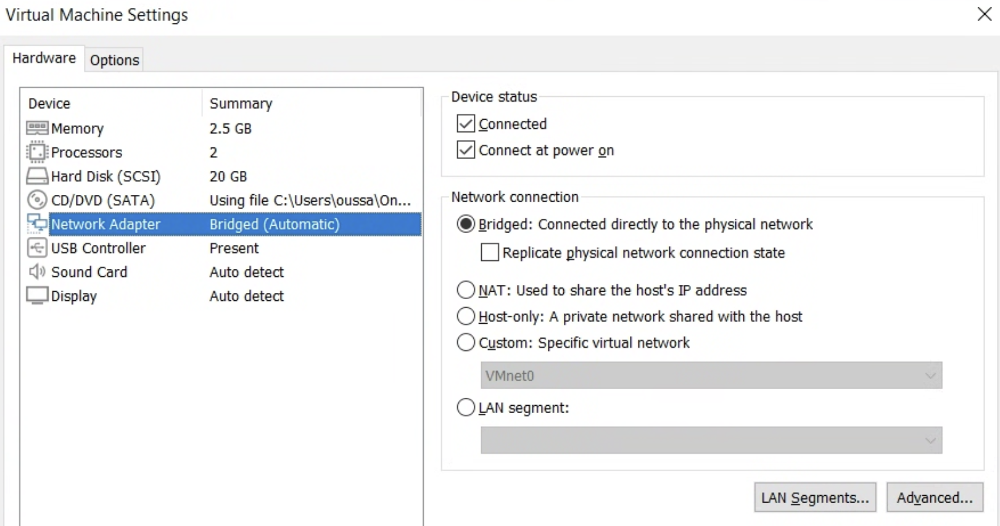
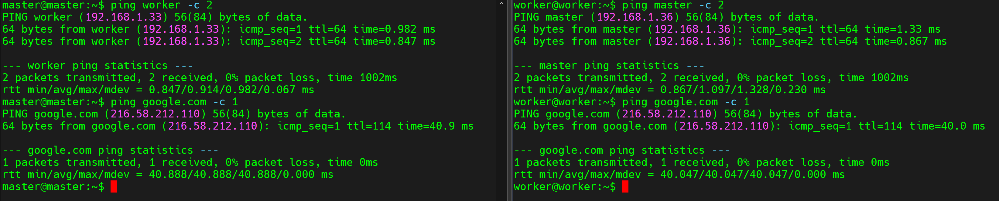
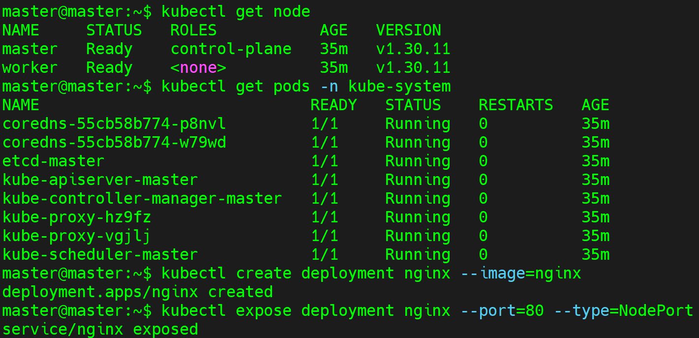
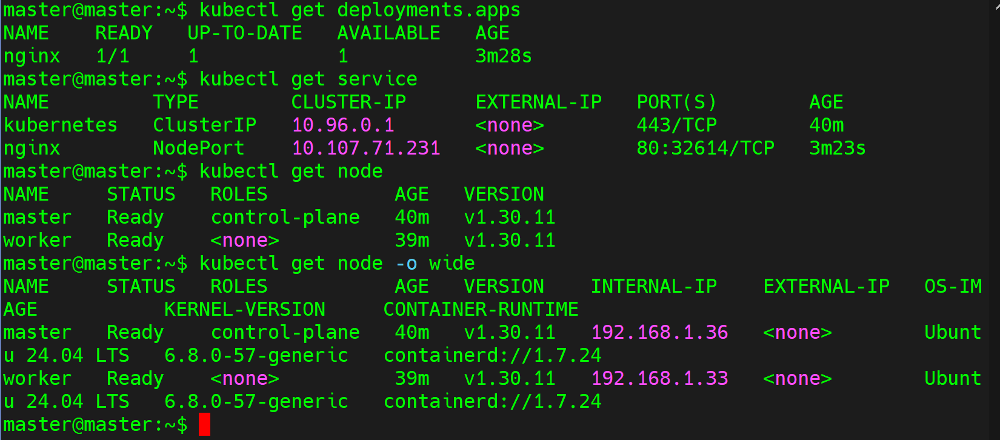
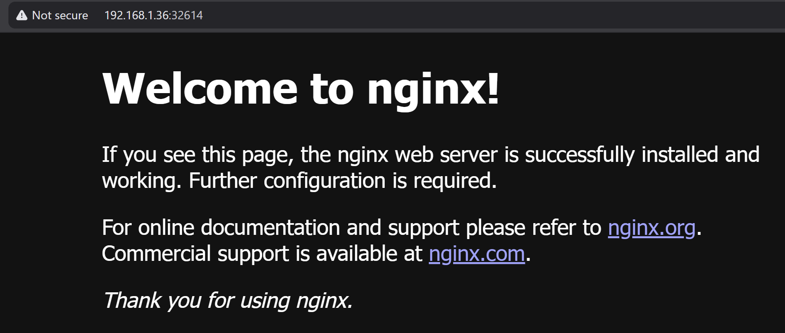
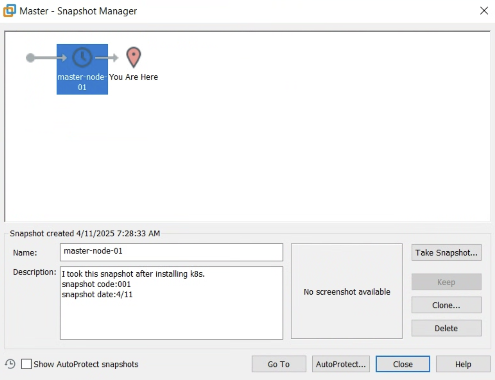

# Installing Kubernetes using KubeADM in VMware Worstation

## Prerequisites
- 2+ vCPUs, 2GB+ RAM and 20GB+ free disk space per VM
- Vmware Workstation
- Ubuntu 20.04/22.04 LTS (recommended)

## Installation

### Installing Ubuntu in VMware
1. Create two VMs name them as following :

    - The `Master` VM will be our control node (we gonna deploy the kubernetes control plan on this node)

    - The `Worker` VM will be the worker node (we gonna deploy application on this node)
2. Install Ubuntu on them (I gave each VM : 2 vCPU, 2.5GB RAM and 20GB of disk)
3. Change the network adapter of the VMs to `Bridged `, So the VMs will be in the same network with our host

4. After the installation make sure that the VMs in the same network and they can access to the internet


### Disable Swap (Both nodes)
```bash
sudo swapoff -a
sudo sed -i '/ swap / s/^\(.*\)$/#\1/g' /etc/fstab  # Permanent
```

### Enable Kernel Modules & Sysctl (Both nodes)
```bash
cat <<EOF | sudo tee /etc/modules-load.d/k8s.conf
overlay
br_netfilter
EOF

sudo modprobe overlay
sudo modprobe br_netfilter

cat <<EOF | sudo tee /etc/sysctl.d/k8s.conf
net.bridge.bridge-nf-call-iptables  = 1
net.bridge.bridge-nf-call-ip6tables = 1
net.ipv4.ip_forward                 = 1
EOF

sudo sysctl --system
```

### Install Container Runtime (Both nodes)
```bash
sudo apt-get install -y containerd

#Configure containerd 
sudo mkdir -p /etc/containerd
sudo cat <<EOF | sudo tee /etc/containerd/config.toml
version = 2
[plugins."io.containerd.grpc.v1.cri"]
  sandbox_image = "registry.k8s.io/pause:3.8"
  [plugins."io.containerd.grpc.v1.cri".containerd]
    discard_unpacked_layers = true
    [plugins."io.containerd.grpc.v1.cri".containerd.runtimes.runc]
      runtime_type = "io.containerd.runc.v2"
      [plugins."io.containerd.grpc.v1.cri".containerd.runtimes.runc.options]
        SystemdCgroup = true
EOF

sudo systemctl restart containerd


# Configure containerd (SECOND OPTION)
# sudo mkdir -p /etc/containerd
# containerd config default | sudo tee /etc/containerd/config.toml >/dev/null
# sudo sed -i 's/SystemdCgroup = false/SystemdCgroup = true/' /etc/containerd/config.toml
# sudo systemctl restart containerd
```

### Install kubeadm, kubelet, kubectl (Both nodes)
```bash
# Packages needed to use the Kubernetes apt repository
sudo apt-get install -y apt-transport-https ca-certificates curl gpg

# Download the public signing key for the Kubernetes package repositories
curl -fsSL https://pkgs.k8s.io/core:/stable:/v1.30/deb/Release.key | sudo gpg --dearmor -o /etc/apt/keyrings/kubernetes-apt-keyring.gpg

# Add the appropriate Kubernetes apt repository
echo 'deb [signed-by=/etc/apt/keyrings/kubernetes-apt-keyring.gpg] https://pkgs.k8s.io/core:/stable:/v1.30/deb/ /' | sudo tee /etc/apt/sources.list.d/kubernetes.list

# Update the apt package index, install kubelet, kubeadm and kubectl, and pin their version
sudo apt-get update
sudo apt-get install -y kubelet kubeadm kubectl
sudo apt-mark hold kubelet kubeadm kubectl # Prevent auto-updates
```

### Initialize Control Plane Node (Master node)
```bash
sudo kubeadm init --pod-network-cidr=10.244.0.0/16

# After completion, run these as regular user:
mkdir -p $HOME/.kube
sudo cp -i /etc/kubernetes/admin.conf $HOME/.kube/config
sudo chown $(id -u):$(id -g) $HOME/.kube/config
```

### Install Pod Network (Flannel) (Master node)
```bash
kubectl apply -f https://github.com/flannel-io/flannel/releases/latest/download/kube-flannel.yml
#NOTE : YOU SHOUD INIT THE KUBEADM WITH --pod-network-cidr=10.244.0.0/16
```

### Enable KUBECTL auto compelition (Master node)
```bash
# Install bash completion if not installed
sudo apt-get install bash-completion -y

# Enable kubectl completion
source <(kubectl completion bash)

# Add the command to your .bashrc to enable autocompletion permanently
echo "source <(kubectl completion bash)" >> ~/.bashrc

# Reload the shell
source ~/.bashrc
```
### Join Worker Nodes (Worker node)

```bash
# Run this command on your master node
kubeadm token create --print-join-command
# Then copy the OUTPUT and run it in the WORKER node
```
### Verify Installation
```bash
# Check nodes
kubectl get nodes -o wide

# Check system pods
kubectl get pods -n kube-system

# Check cluster info
kubectl cluster-info

# Deploy an application for testing
kubectl create deployment nginx --image=nginx
kubectl expose deployment nginx --port=80 --type=NodePort
```
From my installation


Check deployment and service


Verify accessing to the deployment


## Make a snapshot
For this moment everything working great, we can take a snapshot of our VMs state in case of failure we can revert to our privious state..



